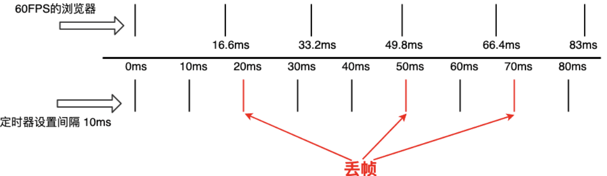

# RAF

为提高参与度,以提问的形式帮助大家集中注意力.

## 是什么

- HTML5 新增加的 API

- window 对象的一个方法，window.requestAnimationFrame

- ***浏览器***(所以只能在浏览器中使用)用于定时循环操作的一个接口，类似于setTimeout

- 兼容性

## 干什么

- 主要用途是按**帧**对网页中的DOM 动画、Canvas 动画、SVG 动画、WebGL 动画等进行统一的刷新***重绘***, 从而节省系统资源，提高系统性能，改善视觉效果

- 由系统来决定回调函数的执行时机，在运行时浏览器会自动优化方法的调用

  - 显示器有固定的刷新频率（60Hz 或 75Hz），也就是说，每秒最多只能重绘 60 次或 75 次，requestAnimationFrame 的基本思想让页面重绘的频率与这个刷新频率保持同步。
  
  - 比如显示器屏幕刷新率为 60Hz，使用requestAnimationFrame API，那么回调函数就每1000ms / 60 ≈ 16.7ms执行一次；如果显示器屏幕的刷新率为 75Hz，那么回调函数就每1000ms / 75 ≈ 13.3ms执行一次。

  - 通过requestAnimationFrame调用回调函数引起的页面重绘或回流的时间间隔和显示器的刷新时间间隔相同。所以 requestAnimationFrame 不需要像setTimeout那样传递时间间隔，而是浏览器通过系统获取并使用显示器刷新频率。

  - 比如一个动画，宽度从 0px 加一递增到 100px。无缓动效果的情况下，浏览器重绘一次，宽度就加 1。

## 为什么

- 提升性能，防止掉帧
  > code

  - 原因有二：
  - 1. setTimeout的实际执行时间一般比其设定的时间晚一些
  - 2. 刷新频率受屏幕分辨率和屏幕尺寸影响，不同设备的屏幕刷新率可能不同，setTimeout只能设置固定的时间间隔，这个时间和屏幕刷新间隔可能不同
  - 3. setTimeout的执行只是在内存中对图像属性进行改变，这个改变必须要等到下次浏览器重绘时才会被更新到屏幕上
  
  图示为没有考虑1的情况下，考虑了问题会加重
  
    - 假设屏幕是每隔16.7ms刷新一次，而setTimeout每隔10ms设置图像向左移动1px,就会出现如下的绘制过程：

        第0ms: 屏幕未刷新，等待中，setTimeout也未执行，等待中；

        第10ms：屏幕未刷新，等待中，setTimeout开始执行并设置图像属性left=1px;

        第16.7ms：屏幕刷新，屏幕上的图像向左移动了1px，setTimeout未执行，继续等待中；

        第20ms：屏幕为刷新，等待中，setTimeout开始执行并设置left=2px;

        第30ms: 屏幕未刷新，等待中，setTimeout开始执行并设置left=3px;

        第33.4ms: 屏幕开始刷新，屏幕上的图像向左移动了3px， setTimeout未执行，继续等待中；

        。。。
        可以看到，*屏幕并没有展示left=2px的那一帧画面，图像直接从1px的位置跳到了3px的位置，这就是丢帧的现象*，这种现象就会引起动画卡顿。而requestAnimationFrame就是为了解决上述问题出现的：该接口以浏览器的显示频率来作为其动画动作的频率，比如浏览器每10ms刷新一次，动画回调也每10ms调用一次，这样就不会存在过度绘制的问题，动画不会掉帧，自然流畅

- 节约CPU、电力
  > code
  - 当页面处于未激活的状态下，该页面的屏幕刷新任务会被系统暂停，由于requestAnimationFrame保持和屏幕刷新同步执行，所以也会被暂停。

- 节流
  > 充分利用显示器的刷新机制，比较节省系统资源
  - 一个刷新间隔内函数执行多次时没有意义的，因为显示器每 16.7ms 刷新一次，多次绘制并不会在屏幕上体现出来
  - 在高频事件（resize，scroll等）中，使用requestAnimationFrame可以防止在一个刷新间隔内发生多次函数执行，这样保证了流畅性，也节省了函数执行的开销
  - 某些情况下可以直接使用requestAnimationFrame替代 Throttle 函数，都是限制回调函数执行的频率

## 和事件循环的关系

    EventLoop执行过程：

    1. 执行同步代码
    2. 执行当前队列尾部所有微任务
    3. 必要的话渲染UI（浏览器是60hz刷新率，所以16ms一帧更新一次UI）

      1. resize/scroll事件（16Ms一次，自带节流）
      2. 判断是否触发media query
      3. 更新动画发送事件
      4. 全屏操作事件
      5. 执行requestAnimationFrame回调
      6. 执行intersectionObserver回调
      7. 更新UI
      8. 如果还有时间，自行requestldleCallback


## 兼容性处理

 > Opera浏览器的技术师Erik Möller设计的，使得更好得兼容各种浏览器，但基本上他的代码就是判断使用4ms还是16ms的延迟，来最佳匹配60fps。

```js
  // 只考虑60Hz
    window.requestAnimationFrame = (function() {
      return window.requestAnimationFrame ||
            window.webkitRequestAnimationFrame ||
            window.mozRequestAnimationFrame ||
            function(callback) {
              window.setTimeout(callback, 1000/60);
            }
    })();
    // Erik Möller ***判断使用4ms还是16ms的延迟***
    (function() {
      var lastTime = 0;
      var vendors = ['webkit', 'moz'];

      //如果window.requestAnimationFrame为undefined先尝试浏览器前缀是否兼容
      for(var x = 0; x < vendors.length && !window.requestAnimationFrame; ++x) {
        window.requestAnimationFrame = window[vendors[x] + 'RequestAnimationFrame'];
        window.cancelAnimationFrame = window[vendors[x] + 'CancelAnimationFrame'] ||//webkit中此取消方法的名字变了
                                      window[vendors[x] + 'CancelRequestAnimationFrame'];
      }

      //如果仍然不兼容，则使用setTimeOut进行兼容操作
      if(!window.requestAnimationFrame) {
        window.requestAnimationFrame = function(callback, element) {
          var currTime = new Date().getTime();
          var timeToCall = Math.max(0, 16.7 - (currTime - lastTime));
          var id = window.setTimeout(function() {
            callback(currTime + timeToCall);
          }, timeToCall);
          lastTime = currTime + timeToCall;
          return id;
        }
      }

      if(!window.cancelAnimationFrame) {
        window.cancelAnimationFrame = function(id) {
          clearTimeout(id);
        }
      }
    })();
  ```

- https://zhuanlan.zhihu.com/p/45201506

- setTimeout

  - 可以通过setTimeout和setInterval方法来在脚本中实现动画，但是这样效果可能不够流畅，且会占用额外的资源。可参考《Html5 Canvas核心技术》中的论述：
  它们有如下的特征：
  1、即使向其传递毫秒为单位的参数，它们也不能达到ms的准确性。这是因为javascript是单线程的，可能会发生阻塞。
  2、没有对调用动画的循环机制进行优化。
  3、没有考虑到绘制动画的最佳时机，只是一味地以某个大致的事件间隔来调用循环。
  其实，使用setInterval或setTimeout来实现主循环，根本错误就在于它们抽象等级不符合要求。我们想让浏览器执行的是一套可以控制各种细节的api，实现如“最优帧速率”、“选择绘制下一帧的最佳时机”等功能。但是如果使用它们的话，这些具体的细节就必须由开发者自己来完成。

  requestAnimationFrame不需要使用者指定循环间隔时间，浏览器会基于当前页面是否可见、CPU的负荷情况等来自行决定最佳的帧速率，从而更合理地使用CPU

  - 传统的 javascript 动画是通过定时器 setTimeout 或者 setInterval 实现的。但是定时器动画一直存在两个问题，第一个就是动画的循时间环间隔不好确定，设置长了动画显得不够平滑流畅，设置短了浏览器的重绘频率会达到瓶颈，推荐的最佳循环间隔是17ms（大多数电脑的显示器刷新频率是60Hz，1000ms/60）；第二个问题是定时器第二个时间参数只是指定了多久后将动画任务添加到浏览器的UI线程队列中，如果UI线程处于忙碌状态，那么动画不会立刻执行。为了解决这些问题，H5 中加入了 requestAnimationFrame;

## 弊端

- 兼容性

- 而唯一的不足可能就是它天生的不确定性，我们不知道它何时被调用，但这就是我们必须要面对的。

- requestAnimationFrame是在主线程上完成。这意味着，如果主线程非常繁忙，requestAnimationFrame的动画效果会大打折扣。

主要原因在于 raf更加智能，它并非加快执行速度，而是适当时候降帧，防止并解决丢帧问题 。当它发现无法维持60fps的频率时，它会把频率降低到30fps来保持帧数的稳定。也就是说如果上一次raf的回调执行时间过长，那么触发下一次raf回调的时间就会缩短，反之亦然，这也是为什么说由浏览器来决定执行时机性能会更好。

那么什么场景下，requestAnimationFrame 会在一帧内被多次调用呢？熟悉事件的同学应该马上能想到 mousemove, scroll 这类事件。

所以前面我们提到的问题就是：因为 requestAnimationFrame 不管理回调函数，在滚动、触摸这类*高触发频率*的事件回调里，如果调用 requestAnimationFrame 然后绘制动画，可能会造成多余的计算和绘制。例如：

window.addEventListener('scroll', e => {
    window.requestAnimationFrame(timestamp => {
        animation(timestamp)
    })
})

在上面代码中，scroll 事件可能在一帧内多次触发，所以 animation 函数可能会在一帧内重复绘制，造成不必要的计算和渲染。

解决方法

对于这种高频发事件，一般的解决方法是使用节流函数。但是在这里使用节流函数并不能完美解决问题。因为节流函数是通过时间管理队列的，而 requestAnimationFrame 的触发时间是不固定的，在高刷新频率的显示屏上时间会小于 16.67ms，页面如果被推入后台，时间可能大于 16.67ms。

完美的解决方案是通过 requestAnimationFrame 来管理队列，其思路就是保证 requestAnimationFrame 的队列里，同样的回调函数只有一个。示意代码如下：

const onScroll = e => {
    if (scheduledAnimationFrame) { return }

    scheduledAnimationFrame = true
    window.requestAnimationFrame(timestamp => {
        scheduledAnimationFrame = false
        animation(timestamp)
    })
}
window.addEventListener('scroll', onScroll)

但是每次都要写这么一堆代码，也有点麻烦。所以我开源了 [raf-plus](weiying-shenzhen/raf-plus) 库用于解决这个问题，有需要的的同学可以用用~

结论

requestAnimationFrame 不管理回调函数队列，而滚动、触摸这类高触发频率事件的回调可能会在同一帧内触发多次。所以正确使用 requestAnimationFrame 的姿势是，在同一帧内可能调用多次 requestAnimationFrame 时，要管理回调函数，防止重复绘制动画。

## 相关API

- cancelAnimationFrame方法用于取消重绘

## 例证

- 对大量数据的渲染(插入数据的例子)

- 对比marginLeft增长情况

- 红蓝条渲染