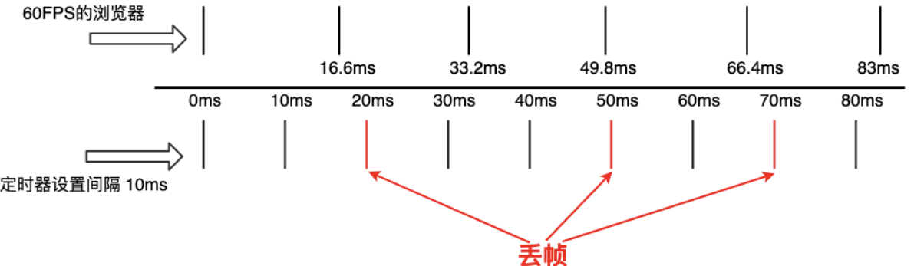
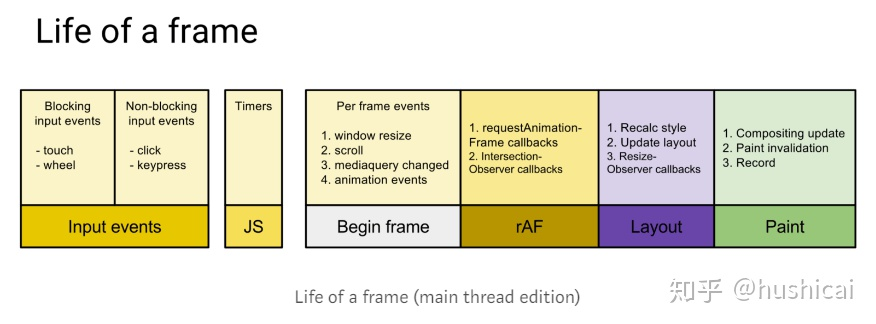

# RAF

## setTimeOut的弊端

- 定时器时间设置长了动画显得不够平滑流畅，设置短了浏览器的重绘频率会达到瓶颈，推荐的最佳循环间隔是17ms

- 设置的时间为大致时间，指定了多久后将动画任务添加到浏览器的UI线程队列中，如果UI线程处于忙碌状态，那么动画不会立刻执行。

- 不管当前页面状态怎么样 它会一直执行

## 是什么

- **浏览器** 按 **帧** 重绘

- 产生负面影响？

## 干什么

- 节省资源，提高性能，改善视觉效果
  >由系统来决定回调函数的执行时机，在运行时浏览器会自动优化方法的调用

## 为什么

- 防止掉帧，提升性能

  - 原因1. setTimeout***大致时间***，因为实际执行时间一般比其设定的时间晚一些
    > code001

  - 原因2. setTimeout设置固定的时间间隔和屏幕刷新间隔可能不同
    > code002

    

- 节约CPU、电力
  > code003

  - 当页面处于未激活的状态下，该页面的屏幕刷新任务会被系统暂停，由于requestAnimationFrame保持和屏幕刷新同步执行，所以也会被暂停。

- 节流
  > code

  - 在高频事件（resize，scroll等）中，使用requestAnimationFrame可以防止在一个刷新间隔内发生多次函数执行，这样保证了流畅性，也节省了函数执行的开销,充分利用显示器的刷新机制，比较节省系统资源

## 和事件循环的关系

    EventLoop执行过程：

    1. 执行同步代码
    2. 执行当前队列尾部所有微任务
    3. 必要的话渲染UI（浏览器是60hz刷新率，所以16ms一帧更新一次UI）

      1. resize/scroll事件（16Ms一次，自带节流）
      2. 判断是否触发media query
      3. 更新动画发送事件
      4. 全屏操作事件
      5. √ 执行requestAnimationFrame回调
      6. 执行intersectionObserver回调
      7. 更新UI
      8. 如果还有时间，自行requestldleCallback

      重排 绘制



## 兼容性处理

 > Opera浏览器的技术师Erik Möller设计的，使得更好得兼容各种浏览器，但基本上他的代码就是判断使用4ms还是16ms的延迟，来最佳匹配60fps。

```js
  // 只考虑60Hz
    window.requestAnimationFrame = (function() {
      return window.requestAnimationFrame ||
            window.webkitRequestAnimationFrame ||
            window.mozRequestAnimationFrame ||
            function(callback) {
              window.setTimeout(callback, 1000/60);
            }
    })();
    // Erik Möller ***判断使用4ms还是16ms的延迟***
  ```

## 弊端

- 兼容性

- requestAnimationFrame是在主线程上完成。这意味着，如果主线程非常繁忙，requestAnimationFrame的动画效果会大打折扣。
  > 更加智能，60fps=>30fps来保持帧数的稳定。也就是说如果上一次raf的回调执行时间过长，那么触发下一次raf回调的时间就会缩短

- 而唯一的不足可能就是它天生的不确定性，我们不知道它何时被调用，但这就是我们必须要面对的。

结论

requestAnimationFrame 不管理回调函数队列，而滚动、触摸这类高触发频率事件的回调可能会在同一帧内触发多次。
所以正确使用 requestAnimationFrame 的姿势是，在同一帧内可能调用多次 requestAnimationFrame 时，要管理回调函数，防止重复绘制动画。

## 相关API

- cancelAnimationFrame方法用于取消重绘

## 例证

- 对大量数据的渲染(插入数据的例子)