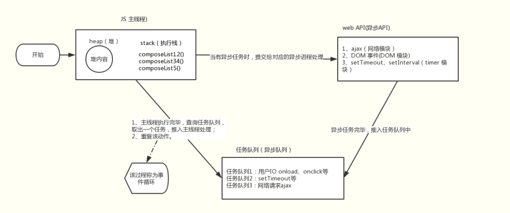
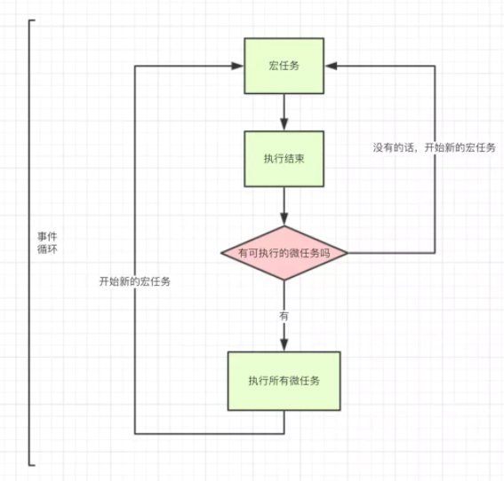

# 事件循环机制

- 遗漏： 代码延申，堆 栈， js的运行机制

- ❓ 问题一

```js
// 1 4 6 3 12 8 2 11 10 9
// -*12 -8 -+11
// -2 -10 -+9
console.log(1)
process.nextTick(() => {
  console.log(8)
  setTimeout(() => {
    console.log(9)
  })
})
setTimeout(() => {
  console.log(2)
  new Promise(() => {
    console.log(11)
  })
})
requestIdleCallback(() => { // ?
  console.log(7)
})
let promise = new Promise((resolve,reject) => {
  setTimeout(() => {
    console.log(10)
  })
  resolve()
  console.log(4)
})
fn()
console.log(3)
promise.then(() => {
  console.log(12)
})
function fn(){
  console.log(6)
}
process.nextTick(() => {
 console.log('nextTick')
 process.nextTick(() => {
   console.log('nextTick')
   process.nextTick(() => {
     console.log('nextTick')
     process.nextTick(() => {
       console.log('nextTick')
     })
   })
 })
})
```

> 关于requestIdleCallback
> 1、4、6、3、12、8、2、11、10、9、7

// 1 6 3 8 4 12 2 11 9 10
// 8 4 12 11（9啥时候放进去的？）
// 2 9 10（11 啥时候放进去的？）

- ❓ 问题二

  - 浏览器的异步执行与js的单线程

## 概念解析纠错

- 事件循环不是js的机制，而应该是js运行环境的机制。

  > js的执行环境（Runtime）就是上面所说的浏览器、node、Ringo, js在不同环境下的执行机制可能并不相同
  > nodejs的event是基于libuv，而浏览器的event loop则在html5的规范中有明确定义
  > 纠正标题，今天说的是***浏览器的事件循环机制***

- js的执行引擎里只有堆和栈而已，剩下的任务队列事件循环都属于执行环境。ECMAScript中没有event loops，它是在HTML Standard定义的。

  > 引擎指的是虚拟机（Engine），对于Node来说是V8、对Chrome来说是V8、对Safari来说js Core，对Firefox来说是SpiderMonkey。

- js引擎的内部运行机制跟事件循环没有半毛钱的关系

- 事件循环可以理解为实现异步的一种方式。

  > 我们来看看event loop在HTML Standard中的定义章节：
  > 为了协调事件，用户交互，脚本，渲染，网络等，用户代理必须使用本节所述的event loop。
  > 事件，用户交互，脚本，渲染，网络这些都是我们所熟悉的东西，他们都是由event loop协调的。触发一个click事件，进行一次ajax请求，背后都有event loop在运作。

## 简述js运行机制

> 主线程类似一个加工厂，它只有一条流水线，待执行的任务就是流水线上的原料，只有前一个加工完，后一个才能进行。event loops就是把原料放上流水线的工人。只要已经放在流水线上的，它们会被依次处理，称为同步任务。一些待处理的原料，工人会按照它们的种类排序，在适当的时机放上流水线，这些称为异步任务。
> js 有一个主线程 main thread，和调用栈 call-stack 也称之为执行栈。所有的任务都会放到调用栈中等待主线程来执行。待执行的任务就是流水线上的原料，只有前一个加工完，后一个才能进行。event loops就是把原料放上流水线的工人，协调用户交互，脚本，渲染，网络这些不同的任务。

<!--   -->
<!-- - 如上图为事件循环示例图（或js运行机制图），流程如下：
  - step1：主线程读取js代码，此时为同步环境，形成相应的堆和执行栈；
  - step2: 主线程遇到异步任务，指给对应的异步进程进行处理（WEB API）;
  - step3: 异步进程处理完毕（Ajax返回、DOM事件处罚、Timer到等），将相应的异步任务推入任务队列；
  - step4: 主线程执行完毕，查询任务队列，如果存在任务，则取出一个任务推入主线程处理（先进先出）；
  - step5: ***重复执行step2、3、4；称为事件循环***。
　　执行的大意：同步环境执行(step1) -> 事件循环1(step4) -> 事件循环2(step4的重复)…
其中的异步进程有：
a、类似onclick等，由浏览器内核的DOM binding模块处理，事件触发时，回调函数添加到任务队列中；
b、setTimeout等，由浏览器内核的Timer模块处理，时间到达时，回调函数添加到任务队列中；
c、Ajax，由浏览器内核的Network模块处理，网络请求返回后，添加到任务队列中 -->

### 微任务 宏任务

> 一个event loop里有一个或者多个task队列（宏任务），只有一个microtask 队列。
> 延伸: Promise的定义在 ECMAScript规范而不是在HTML规范中，但是ECMAScript规范中有一个jobs的概念和microtasks很相似。在Promises/A+规范的Notes 3.1中提及了promise的then方法可以采用“宏任务（macro-task）”机制或者“微任务（micro-task）”机制来实现。所以开头提及的promise在不同浏览器的差异正源于此，有的浏览器将then放入了macro-task队列，有的放入了micro-task 队列。

- 微任务： promise.then、process.nextTick、Object.observe(已废弃)、MutationObserver(html5新特性)

> HTML Standard没有具体指明哪些是microtask任务源，通常认为是microtask任务源的上面这些

- 宏任务（macrotask）： setTimeout、setInterval、setImmediate、I/O、UI rendering

### 关于渲染

- 执行完microtask队列里的任务，有可能会渲染更新。（浏览器很聪明，在一帧以内的多次dom变动浏览器不会立即响应，而是会积攒变动以最高60HZ的频率更新视图）

## 事件循环的过程

> 事件循环的顺序，决定js代码的执行顺序。进入整体代码(宏任务)后，开始第一次循环。接着执行所有的微任务。然后再次从宏任务开始，找到其中一个任务队列执行完毕，再执行所有的微任务


动图观摩[https://user-gold-cdn.xitu.io/2019/1/12/16841d6392e8f537?imageslim]

- 执行流程如下:

  - 检查 Macrotask 队列是否为空,若不为空，则进行下一步，若为空，则跳到3

  - 从 Macrotask 队列中取队首(在队列时间最长)的任务进去执行栈中执行(仅仅一个)，执行完后进入下一步

  - 检查 Microtask 队列是否为空，若不为空，则进入下一步，否则，跳到1（开始新的事件循环）

  - 从 Microtask 队列中取队首(在队列时间最长)的任务进去事件队列执行,执行完后，跳到3

  - 其中，在执行代码过程中新增的microtask任务会在当前事件循环周期内执行，而新增的macrotask任务只能等到下一个事件循环才能执行了。

```js
// eventLoop队列数组，先进先出
var eventLoop = [], event;
// “永远”执行，事件循环嘛
while(true) {
    // 一次tick
    if (eventLoop.length > 0) {
        event = eventLoop.shift() // 拿到队列中下一个事件
        event() // 执行。这代码里面可能产生新的event放在eventLoop中
    }
}
// 事件循环取macroTaskQueue
// 微任务队列只有一个，而且每一次tick，都会清空微任务队列
for (macroTask of macroTaskQueue) {
    handleMacroTask();

    for (microTask of microTaskQueue) {
        handleMicroTask(microTask);
    }
}
```

## 未来填坑系列讲解

 ***从event loop规范探究javaScript异步及浏览器更新渲染时机*** 下篇可讲[https://github.com/aooy/blog/issues/5]
 ***requestAnimationFrame前端开发者压根无法把握住渲染前的那一个点***[https://juejin.im/post/6844904056457003015]
 ***js的计时器的工作原理***[https://segmentfault.com/a/1190000002633108]
 ***[https://github.com/amandakelake/blog/issues/26]***