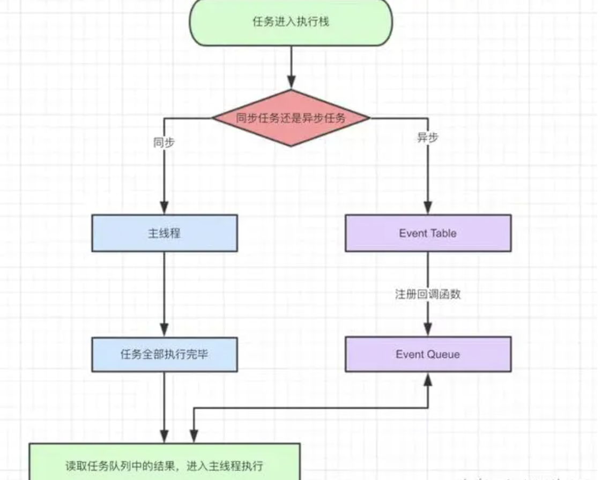

# 事件循环机制

- 遗漏： js 的运行机制，为啥先从宏任务开始,什么时候开始执行

- ❓ 问题一

```js
console.log(1);
process.nextTick(() => {
  console.log(8);
  setTimeout(() => {
    console.log(9);
  });
});
setTimeout(() => {
  console.log(2);
  new Promise(() => {
    console.log(11);
  });
});
requestIdleCallback(() => {
  // ?
  console.log(7);
});
let promise = new Promise((resolve, reject) => {
  setTimeout(() => {
    console.log(10);
  });
  resolve();
  console.log(4);
});
fn();
console.log(3);
promise.then(() => {
  console.log(12);
})
function fn() {
  console.log(6);
}
```

> 补充两点
> 1、4、6、3、12、8、2、11、10、9、7


- ❓ 问题二

  - 浏览器的异步执行与 js 的单线程

## 概念解析纠错

- 事件循环不是 js 的机制，而应该是 js 运行环境的机制。

  > js 的执行环境（Runtime）就是上面所说的浏览器、node、Ringo, js 在不同环境下的执行机制可能并不相同
  > nodejs 的 event 是基于 libuv，而浏览器的 event loop 则在 html5 的规范中有明确定义
  > 纠正标题，今天说的是**_浏览器的事件循环机制_**

- js 的执行引擎里只有堆和栈而已，剩下的任务队列事件循环都属于执行环境。ECMAScript 中没有 event loops，它是在 HTML Standard 定义的。

  > 引擎指的是虚拟机（Engine），对于 Node 来说是 V8、对 Chrome 来说是 V8、对 Safari 来说 js Core，对 Firefox 来说是 SpiderMonkey。

- js 引擎的内部运行机制跟事件循环没有半毛钱的关系

- 事件循环可以理解为实现异步的一种方式。

  > 我们来看看 event loop 在 HTML Standard 中的定义章节：
  > 为了协调事件，用户交互，脚本，渲染，网络等，用户代理必须使用本节所述的 event loop。
  > 事件，用户交互，脚本，渲染，网络这些都是我们所熟悉的东西，他们都是由 event loop 协调的。触发一个 click 事件，进行一次 ajax 请求，背后都有 event loop 在运作。

## 简述 js 运行机制

> 主线程类似一个加工厂，它只有一条流水线，待执行的任务就是流水线上的原料，只有前一个加工完，后一个才能进行。event loops 就是把原料放上流水线的工人。只要已经放在流水线上的，它们会被依次处理，称为同步任务。一些待处理的原料，工人会按照它们的种类排序，在适当的时机放上流水线，这些称为异步任务。
> js 有一个主线程 main thread，和调用栈 call-stack 也称之为执行栈。所有的任务都会放到调用栈中等待主线程来执行。待执行的任务就是流水线上的原料，只有前一个加工完，后一个才能进行。event loops 就是把原料放上流水线的工人，协调用户交互，脚本，渲染，网络这些不同的任务。



- js 运行机制图，流程如下：

  - step1：主线程读取 js 代码，此时为同步环境，形成相应的堆和执行栈；

  - step2: 主线程遇到异步任务，指给对应的异步进程进行处理;

  - step3: 异步进程处理完毕（Ajax 返回、DOM 事件、Timer 等），将相应的异步任务推入任务队列；

  - step4: 主线程执行完毕，会去 Event Queue 读取任务队列，如果存在任务，则取出一个任务推入主线程处理（先进先出）；

  - step5: **_重复执行 step2、3、4；称为事件循环_**。

> 延伸阅读：其中的异步进程有：
> a、类似 onclick 等，由浏览器内核的 DOM binding 模块处理，事件触发时，回调函数添加到任务队列中；
> b、setTimeout 等，由浏览器内核的 Timer 模块处理，时间到达时，回调函数添加到任务队列中；
> c、Ajax，由浏览器内核的 Network 模块处理，网络请求返回后，添加到任务队列中 -->

### 微任务 宏任务

> 一个 event loop 里有一个或者多个 task 队列（宏任务），只有一个 microtask 队列。
> 延伸阅读: Promise 的定义在 ECMAScript 规范而不是在 HTML 规范中，但是 ECMAScript 规范中有一个 jobs 的概念和 microtasks 很相似。在 Promises/A+规范的 Notes 3.1 中提及了 promise 的 then 方法可以采用“宏任务（macro-task）”机制或者“微任务（micro-task）”机制来实现。所以开头提及的 promise 在不同浏览器的差异正源于此，有的浏览器将 then 放入了 macro-task 队列，有的放入了 micro-task 队列。

- 微任务： promise.then、process.nextTick、Object.observe(已废弃)、MutationObserver(html5 新特性)

> HTML Standard 没有具体指明哪些是 microtask 任务源，通常认为是 microtask 任务源的上面这些
> 在代码执行的过程中可以随时插入 nextTick，并且会保证在下一个宏任务开始之前所执行。

- 宏任务（macrotask）： setTimeout、setInterval、setImmediate、I/O、UI rendering

### 关于渲染

- 执行完 microtask 队列里的任务，有可能会渲染更新。（浏览器很聪明，在一帧以内的多次 dom 变动浏览器不会立即响应，而是会积攒变动以最高 60HZ 的频率更新视图）

## 事件循环的过程

> 事件循环的顺序，决定 js 代码的执行顺序。进入整体代码(宏任务)后，开始第一次循环。接着执行所有的微任务。然后再次从宏任务开始，找到其中一个任务队列执行完毕，再执行所有的微任务
> js 引擎中，存在一个叫 monitoring process 的进程,它会不断检查主线程的执行情况，一旦为空就会去 Event Quene 检查有哪些待执行的函数


[动图观摩](https://user-gold-cdn.xitu.io/2019/1/12/16841d6392e8f537?imageslim)

- 执行流程如下:

  - 检查 Macrotask 队列是否为空,若不为空，则进行下一步，若为空，则跳到 3

  - 从 Macrotask 队列中取队首(在队列时间最长)的任务进去执行栈中执行(仅仅一个)，执行完后进入下一步

  - 检查 Microtask 队列是否为空，若不为空，则进入下一步，否则，跳到 1（开始新的事件循环）

  - 从 Microtask 队列中取队首(在队列时间最长)的任务进去事件队列执行,执行完后，跳到 3

  - 其中，在执行代码过程中新增的 microtask 任务会在当前事件循环周期内执行，而新增的 macrotask 任务只能等到下一个事件循环才能执行了。

```js
// eventLoop队列数组，先进先出
var eventLoop = [],
  event;
// “永远”执行，事件循环嘛
while (true) {
  // 一次tick
  if (eventLoop.length > 0) {
    event = eventLoop.shift(); // 拿到队列中下一个事件
    // 执行。这代码里面可能产生新的event放在eventLoop中
    try {
      event();
    } catch (err) {
      reportError(err);
    }
  }
}
// 事件循环取macroTaskQueue
// 微任务队列只有一个，而且每一次tick，都会清空微任务队列
for (macroTask of macroTaskQueue) {
  handleMacroTask(macroTask);

  for (microTask of microTaskQueue) {
    handleMicroTask(microTask);
  }
}
```

## 未来填坑系列讲解

- [**_从 event loop 规范探究 javaScript 异步及浏览器更新渲染时机_**](https://github.com/aooy/blog/issues/5)

- [**_requestAnimationFrame 前端开发者压根无法把握住渲染前的那一个点_**](https://juejin.im/post/6844904056457003015)

- [**_js 的计时器的工作原理_**](https://segmentfault.com/a/1190000002633108)

- [**\* \***](https://github.com/amandakelake/blog/issues/26)

- [event.js](https://gist.github.com/noonat/368053)
