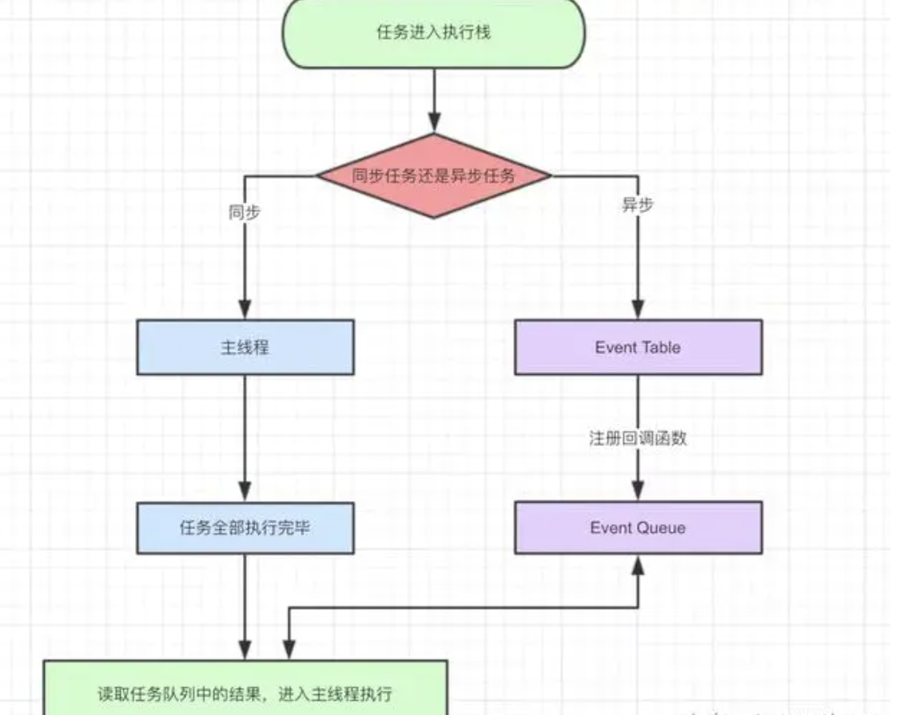
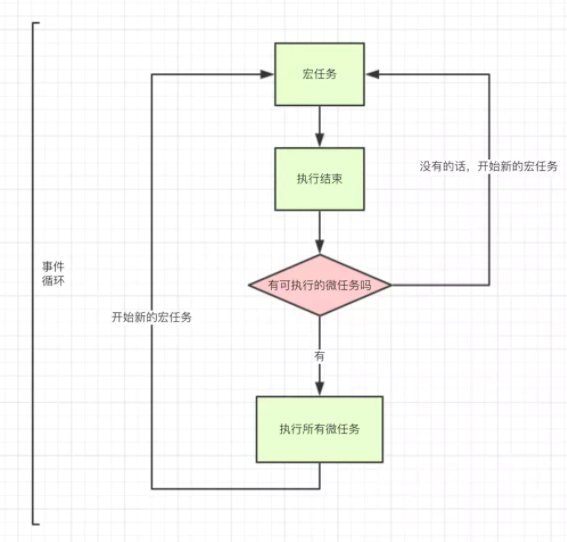

# 事件循环机制

- ❓ 问题一: demo 运行顺序

  > 补充两点
  > 1 4 6 3 +8 +12 +2 11 10 200 400 300 500 9

- ❓ 问题二

  - js的单线程

## 1. 概念解析纠错

- 事件循环不是js的机制，而应该是js运行环境的机制。

  > js 的执行环境（Runtime）就是上面所说的浏览器、node

- 纠正标题，今天说的是**js基于浏览器的事件循环机制**

- js的执行引擎里只有堆和栈而已，剩下的任务队列事件循环都属于执行环境。

  > 引擎指的是虚拟机（Engine），Node/ Chrome => V8、Safari => js Core，Firefox => SpiderMonkey。

- js 引擎的内部运行机制跟事件循环没有半毛钱的关系

- 事件循环可以理解为实现异步的一种方式。

## 2. 简述 js 运行机制

> 主线程 => 加工厂，event loops => 工人。

- js 运行机制图，流程如下：

  - step1：主线程运作；

  - step2: 异步进程处理;

  - step3: 异步任务推入任务队列；

  - step4: 取出一个任务推入主线程处理（先进先出）；

  - step5: **_重复执行 step2、3、4；称为事件循环_**。

### 2.1 微任务 宏任务

- 微任务： promise.then、process.nextTick、Object.observe(已废弃)、MutationObserver(html5 新特性)

> 通常观点。

- 宏任务（macrotask）： setTimeout、setInterval、setImmediate、I/O、UI rendering

### 2.2 关于渲染(后续)

- 执行完 microtask 队列里的任务，有可能会渲染更新。（浏览器很聪明，在一帧以内的多次 dom 变动浏览器不会立即响应，而是会积攒变动以最高 60HZ 的频率更新视图）

## 3. 事件循环的过程

> monitoring process

[动图观摩](https://user-gold-cdn.xitu.io/2019/1/12/16841d6392e8f537?imageslim)

- 执行流程如下:

  - 1. 检查 Macrotask 队列是否为空,若不为空，则进行下一步，若为空，则跳到 3

  - 2. 从 Macrotask 队列中取队首(在队列时间最长)的任务进去执行栈中执行(仅仅一个)，执行完后进入下一步

  - 3. 检查 Microtask 队列是否为空，若不为空，则进入下一步，否则，跳到 1（开始新的事件循环）

  - 4. 从 Microtask 队列中取队首(在队列时间最长)的任务进去事件队列执行,执行完后，跳到 3

  - 其中，在执行代码过程中新增的 microtask 任务会在当前事件循环周期内执行，而新增的 macrotask 任务只能等到下一个事件循环才能执行了。

var eventLoop = [];
while(true) {
  var event = eventLoop.shift();
  event();
}

for (mac of macQueen) {
  handleMac();
  for (mic of micQueen) {
    handleMic();
  }
}

## * 未来填坑系列讲解

- [**_从 event loop 规范探究 javaScript 异步及浏览器更新渲染时机_**](https://github.com/aooy/blog/issues/5)

- [**_requestAnimationFrame 前端开发者压根无法把握住渲染前的那一个点_**](https://juejin.im/post/6844904056457003015)

- [**_js 的计时器的工作原理_**](https://segmentfault.com/a/1190000002633108)

- [**\* \***](https://github.com/amandakelake/blog/issues/26)

- [event.js](https://gist.github.com/noonat/368053)

- [raf](https://lq782655835.github.io/blogs/js/js-base-3.event-loop.html)

- ? nextTick为啥优先

- ? 谁先谁后的问题
